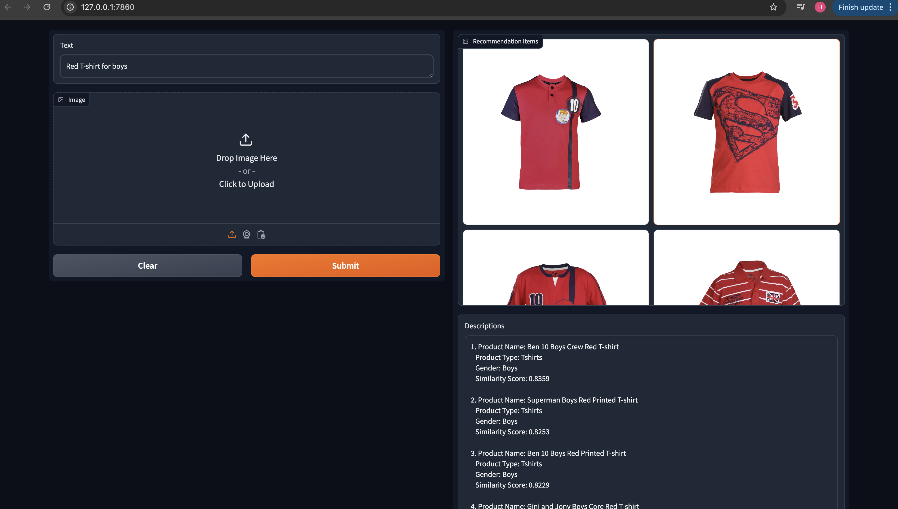
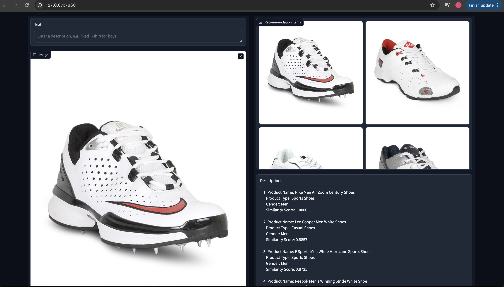

# Fashion Recommendation System
## Introduction
- This project is a recommendation system for fashion items. The system is based on the data from the [Fashion Dataset](https://www.kaggle.com/datasets/vikashrajluhaniwal/fashion-images) on Kaggle.
- This project is used CLIP (CLIP (Contrastive Language-Image Pre-Training) from OpenAI

## Installation
- Clone this repository
- Install the required packages
```bash
pip install -r requirements.txt
```

## Usage
- Run the following command to start the server
```bash
python app.py
```

## Demo Images
- Preview App 

- Result based on the input text

- Result based on the input image



